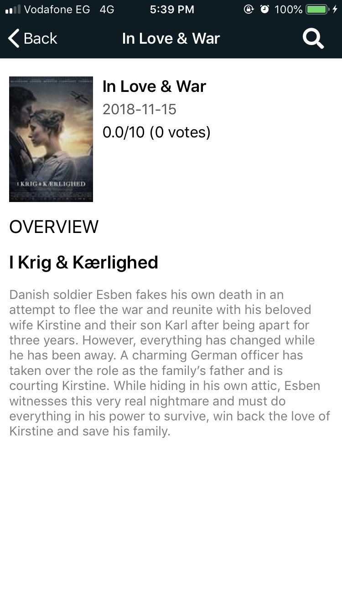
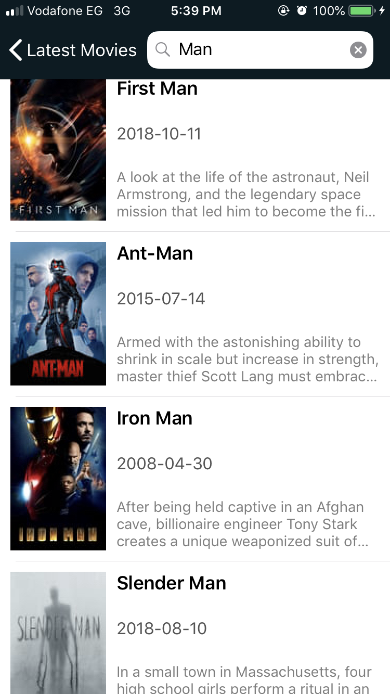

# TheMovieDB

## Project Overview

This project consists of 3 screens:
- Latest movies with infinite scrolling.
- Simple movie details page.
- Search feature without auto complete.

## Images

 Latest movies screen 

 Movie details screen 

 Search screen 

## Architecture

The architecture of the app is MVVM (Model-View-ViewModel).

## Prerequisites

- xcode 10.0
- swift 4.2
- CocoaPods (There is no need to install Pods I already commited all)

## Dependency

* ['Alamofire', '~> 4.7.3'](https://github.com/Alamofire/Alamofire) - Alamofire is an HTTP networking library written in Swift.
* ['UIColor_Hex_Swift', '~> 4.2.0'](https://github.com/yeahdongcn/UIColor-Hex-Swift) - Convenience methods for creating color using RGBA hex string.
* ['Kingfisher', '~> 4.8.1'](https://github.com/onevcat/Kingfisher) - A lightweight, pure-Swift library for downloading and caching images from the web.
* ['FontAwesome.swift', '~> 1.4.5'](https://github.com/thii/FontAwesome.swift) - Font Awesome icons.
